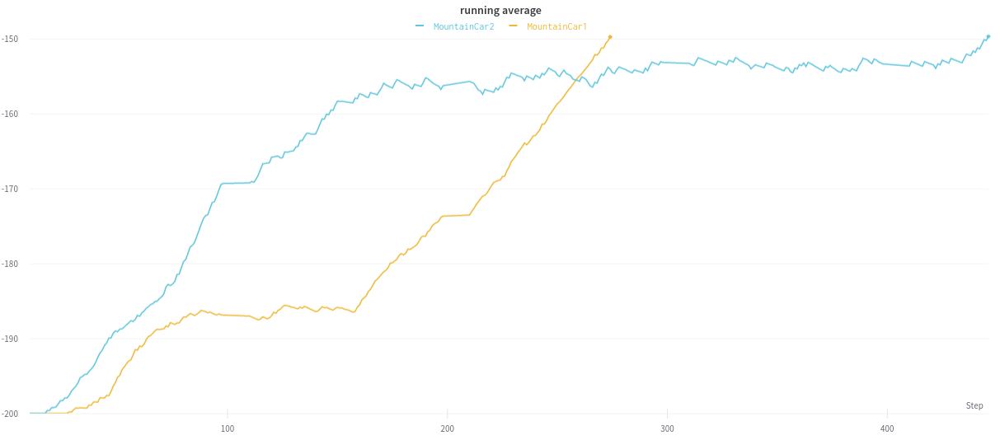

# PingPong-RL
[Policy_Gradients_to_beat_Pong](https://github.com/llSourcell/Policy_Gradients_to_beat_Pong) with Python 3 and Pytorch

## Preliminaries
For installing all necessary Python packages it is very useful to first set up a separate virtual Python environment (e.g. with conda / Virtualenv)

Afterwards, all packages can be installed using `pip install -r requirements.txt`.

## Results
### Simplified TRPO
"simplified" means only using first-order derivative for gradient descent

Process: First evaluate V-Value Network with random actions for 10 Episodes every 100 Episodes and then basiclly follow [this tutorial](https://spinningup.openai.com/en/latest/algorithms/trpo.html) 

#### [MountainCar](https://gym.openai.com/envs/MountainCar-v0/)


Goal: Drive up the mountain in 150 frames on average

Usage:
1. train:
    ```
    python MountainCar.py train
    ```
2. show:
   ```
    python MountainCar.py show -p MountainCar/checkpoint_BEST/policy.pt
    ```
Running average:
